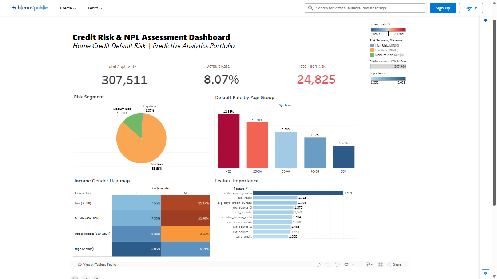

#  Home Credit Default Risk — End-to-End Data Analytics Portfolio


[](https://public.tableau.com/app/profile/raditya.zaki.athaya/viz/CreditRiskNPLAssessmentDashboard/Dashboard1?publish=yes)

Proyek portfolio end-to-end di domain **Fintech / Digital Banking** yang membangun
sistem prediksi risiko kredit dan penilaian Non-Performing Loan (NPL) menggunakan
dataset nyata dari Kaggle. Pipeline mencakup ingesti data ke PostgreSQL, feature
engineering via Advanced SQL, pemodelan prediktif dengan LightGBM, dan explainability
dengan SHAP — dirancang untuk mensimulasikan workflow data analyst/scientist di
industri keuangan.

---

## 📋 Table of Contents
- [Project Structure](#-project-structure)
- [Pipeline Overview](#-pipeline-overview)
- [Dataset](#-dataset)
- [Tech Stack](#-tech-stack)
- [Results](#-results)
- [Quick Start](#-quick-start)
- [Key Findings](#-key-findings)
- [Roadmap](#-roadmap)
- [Author](#-author)

---

## 📁 Project Structure
```
home-credit-default-risk/
|
├── assets/
│   └── dashboard_preview.png
│
├── data/                          # Output artifacts (tidak di-push ke GitHub)
│   ├── application_train.csv      # Raw data (tidak di-push ke GitHub)
│   ├── bureau.csv
│   ├── previous_application.csv
│   ├── lgb_credit_risk_model.pkl  # Trained model
│   ├── feature_importance.csv     # Feature importance output
│   ├── model_summary.txt          # Model performance summary
│   ├── class_distribution.png
│   ├── evaluation_dashboard.png
│   ├── feature_importance.png
│   ├── shap_importance.png
│   └── shap_beeswarm.png
│
├── notebooks/
│   └── Credit_Risk_Predictive_Modeling.ipynb   # Phase 3 — main notebook
│
├── sql_scripts/
│   ├── 01_eda_and_diagnostic.sql               # Phase 2 — EDA queries
│   └── 02_create_master_view.sql               # Phase 2 — master view
│
├── src/
│   └── import_data.py                          # Phase 1 — data ingestion
│
├── .env                           # Kredensial DB (tidak di-push ke GitHub)
├── .gitignore
└── README.md
```
---

## 🔄 Pipeline Overview
```
Phase 1 — Data Engineering
CSV (307k+ rows) ──► Python (pandas + SQLAlchemy) ──► PostgreSQL Database
chunking 50k rows/batch           home_credit_risk
Phase 2 — Data Wrangling & Advanced SQL
PostgreSQL ──► CTEs + LEFT JOIN (3 tables) ──► master_credit_risk_view
COALESCE, aggregation,             28 columns, business-ready
days-to-years transformation
Phase 3 — Predictive Analytics (Current)
master_credit_risk_view ──► Feature Engineering ──► LightGBM Classifier
34 features               ROC-AUC 0.7633
Label Encoding            SHAP Explainability
Median Imputation
Phase 4 — Data Visualization (Pending)
Model Output ──► Tableau Dashboard ──► NPL Monitoring & Business Insights
```
---

## 📊 Dataset

Sumber: [Kaggle — Home Credit Default Risk](https://www.kaggle.com/datasets/megancrenshaw/home-credit-default-risk)

| File | Rows | Description |
|------|------|-------------|
| `application_train.csv` | 307,511 | Data utama peminjam + target label |
| `bureau.csv` | 1,716,428 | Riwayat kredit di institusi lain |
| `previous_application.csv` | 1,670,214 | Riwayat pengajuan pinjaman sebelumnya |

Target variable: `TARGET` (0 = Non-Default, 1 = Default) dengan class imbalance ratio **1:11.4** (default rate 8.07%).

---

## 🛠 Tech Stack

| Layer | Tools |
|-------|-------|
| Language | Python 3.12.3 |
| Database | PostgreSQL 18 (port 5433) |
| Data Processing | pandas, numpy, sqlalchemy, psycopg2 |
| Machine Learning | scikit-learn, LightGBM 4.6.0 |
| Explainability | SHAP 0.52.0 |
| Visualization | matplotlib, seaborn |
| Environment | Jupyter Notebook, python-dotenv |
| BI (Phase 4) | Tableau |

---

## 📈 Results

| Metric | Value |
|--------|-------|
| ROC-AUC Score | **0.7633** |
| Average Precision Score | 0.2456 |
| Optimal Threshold | 0.1489 |
| F1-Score (Default Class) | 0.3116 |
| Recall (Default Class) | 44% |
| Best Iteration | 481 / 2000 |
| Train Size | 246,008 rows |
| Test Size | 61,503 rows |
| Total Features | 34 |

ROC-AUC 0.7633 berada dalam benchmark kompetisi Kaggle Home Credit (0.745–0.780) menggunakan 3 tabel dari total 7 tabel yang tersedia.

### Top 5 Predictive Features (SHAP)

| Rank | Feature | Description |
|------|---------|-------------|
| 1 | `credit_annuity_ratio` | Rasio total kredit terhadap cicilan tahunan |
| 2 | `age_years` | Usia peminjam |
| 3 | `ext_source_mean` | Rata-rata external credit score |
| 4 | `avg_days_credit_bureau` | Rata-rata umur kredit di biro |
| 5 | `annuity_income_ratio` | Rasio cicilan terhadap pendapatan |

---
## 📊 Live Dashboard
Hasil prediksi *Machine Learning* dan analisis profil risiko diwujudkan dalam sebuah *Executive Dashboard* interaktif untuk memudahkan *stakeholder* mengambil keputusan.

👉 **[View Interactive Dashboard on Tableau Public](https://public.tableau.com/app/profile/raditya.zaki.athaya/viz/CreditRiskNPLAssessmentDashboard/Dashboard1?publish=yes)**



Dashboard mencakup:
- KPI summary (total applicants, default rate, high-risk count)
- Risk segment distribution dan score distribution
- Default rate breakdown by age, income tier, dan gender
- Top 10 feature importance dari LightGBM
- Interaktif: klik segmen manapun untuk filter semua chart

**Key Business Insights:**
1. **Demografi Rentan:** Laki-laki dengan pendapatan menengah ke bawah (< 180k) merupakan segmen dengan *Default Rate* tertinggi. Sebaliknya, perempuan dengan pendapatan tinggi (> 360k) adalah segmen paling aman.
2. **Korelasi Usia:** Terdapat tren penurunan risiko seiring bertambahnya usia, di mana kelompok usia < 25 tahun memiliki rasio kredit macet tertinggi.
3. **Riwayat Penolakan:** Nasabah dengan rekam jejak penolakan kredit lebih dari 50% di masa lalu memiliki tendensi jauh lebih besar untuk kembali gagal bayar di masa kini.
---

## 🚀 Quick Start

### Prerequisites
- Python 3.12+
- PostgreSQL 18 berjalan di port 5433
- Dataset sudah didownload dari Kaggle ke folder `data/`

### 1. Clone repository
```bash
git clone https://github.com/rdityaza/credit-risk-analytics.git
cd home-credit-default-risk
```

### 2. Install dependencies
```bash
pip install pandas numpy sqlalchemy psycopg2-binary scikit-learn lightgbm shap \
            matplotlib seaborn imbalanced-learn python-dotenv joblib
```

### 3. Setup environment variable
Buat file `.env` di root folder:
```bash
PG_PASSWORD=your_postgresql_password
```
### 4. Jalankan Phase 1 — Import Data
```bash
python src/import_data.py
```

### 5. Jalankan Phase 2 — Buat Master View
Eksekusi file SQL berikut di pgAdmin atau psql:
```bash
psql -U postgres -p 5433 -d home_credit_risk -f sql_scripts/02_create_master_view.sql
```

### 6. Jalankan Phase 3 — Predictive Modeling
```bash
jupyter notebook notebooks/Credit_Risk_Predictive_Modeling.ipynb
```
Jalankan semua cell dari atas ke bawah secara berurutan.

---

## 🔍 Key Findings

- Peminjam dengan **`credit_annuity_ratio` tinggi** (beban cicilan besar relatif terhadap nilai pinjaman) adalah segmen paling berisiko, menjadi fitur paling prediktif dengan selisih signifikan.
- **External credit score** (`ext_source_1/2/3`) adalah sinyal terkuat dari sisi data eksternal. Missing rate `ext_source_1` mencapai 56%, yang juga menjadi area peningkatan kualitas data yang perlu diprioritaskan.
- **Peminjam muda** (usia < 30 tahun) dengan riwayat kerja singkat (< 2 tahun) dan external credit score rendah membentuk segmen risiko tertinggi secara kumulatif.
- **Threshold optimal 0.1489** (bukan default 0.5) meningkatkan F1-score default class dari 0.0429 menjadi 0.3116 — penurunan threshold ini penting di domain kredit karena false negative jauh lebih mahal secara bisnis.

---

## 🗺 Roadmap

- [x] Phase 1 — Data Engineering (CSV → PostgreSQL)
- [x] Phase 2 — Advanced SQL & Master View
- [x] Phase 3 — Predictive Analytics (LightGBM + SHAP)
- [x] Phase 4 — Tableau Dashboard (NPL Monitoring)

---

## 👤 Author

**Raditya Zaki Athaya**
Mahasiswa Sistem dan Teknologi Informasi, Institut Teknologi Bandung (ITB)
NIM: 18223086

[](https://linkedin.com/in/raditya-zaki-athaya)
[](https://github.com/rdityaza)

---

## 📄 License

Distributed under the MIT License. Dataset berasal dari kompetisi publik Kaggle dan tunduk pada [aturan penggunaan Kaggle](https://www.kaggle.com/terms).
